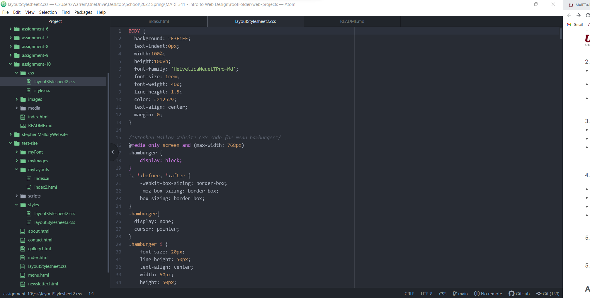

Embed your screenshot here with a relative URL

Describe the difference between the universal, element, class, and id
selector types. When might you choose one over the other to style content?

The different selector types give developers and designers the able to establish
rules and constraints for elements on a website.  The spectrum ranges from the
whole with the universal selector to selecting one unique element with id selector.
The element selector applied by the elements name (div or h2) whereas a class
allows a developers to create two divs or h2s functioning under a variety of
different parameters.

Discuss your color palette. How did you choose your colors?

I am creating a website to showcase artwork.  I am passionate the natural
ecosystem and the animals residing within.  I seek to capture moments of nature
in a true and pure form utilizing a color palette seen by few and only on rare
occasion.  In case the showcase my work, the color palette of the website will
act as a picture frame for each painting.  Bring out the call with nature and
neutral tones. 
