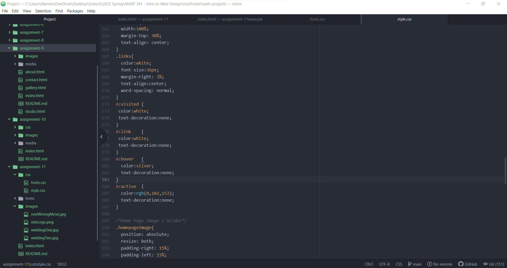

Embed your screenshot here with a relative URL

What is typography?

Typography is the way a message is communicated to a user.  The typography is manipulated by a web developer or designer with font-size, font-spacing, and line width.  For example, changing the font characteristics like size and bold might inform the user that a header to information below.

What is the importance of having fallback fonts or a font stack?

It is important for a web designer to use fallback fonts or font stacks that compliment each other and are used for an assigned function.  One font could be used as the headers where another is a more easily read over longer textboxes.   

What is the difference between a system font, web font, and web-safe font?

System fonts are pre-installed on local devices and systems however they are difficult to interface with the web.  Typically, these fonts are seen in branding and best uploaded as a image. Web-fonts are hosted on a server and require certain elements to get called up correctly.  Google Fonts is a good place for finding free and purchased fonts.  Web-Safe Fonts are on every machine and require little effort to use.  For example, "TIMES New ROMAN" and typically dependent on the manufacturer.
