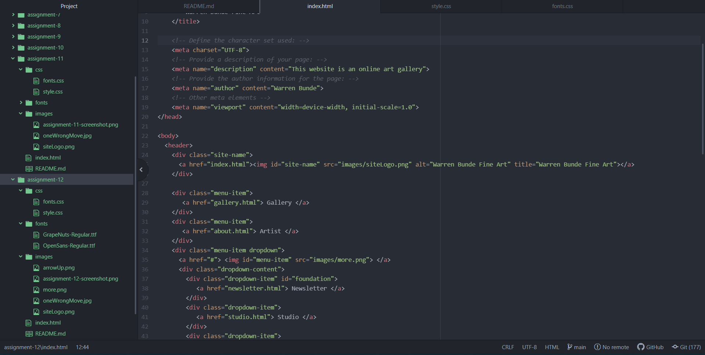

Embed your screenshot here with a relative URL

What is the difference between padding, margin, and borders?

Padding, margin and borders are all how a developer and designer wants to wrap
an element.  The margin is the space surrounding an element's border where the
border acts as a shell.  The padding is the space between content within the
element and element's border.  Each property value can be changed as a one group
or individually.  
