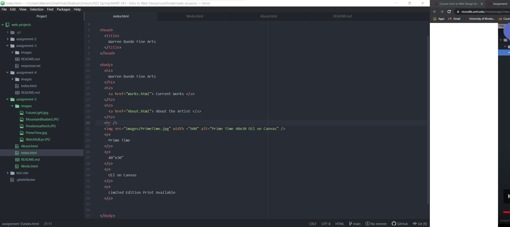

Embed your screenshot here with a relative URL

Tell me about a website you visited using the Wayback Machine. What year is it from?

     I visited Wikipedia with Wayback Machine.  Wikipedia.org originated in 2001.

How is the older version different from the current version today in terms of its overall design?

      Wikipedia.org was a platform of sharing information.  The early stages provided for a variety of unreliable and uncredible sourced information where anyone could say anything.  Over the years Wikipedia.org is slowly sourcing more and more creditable information on their platform.  Early stages of the site were full of links and little information.  
