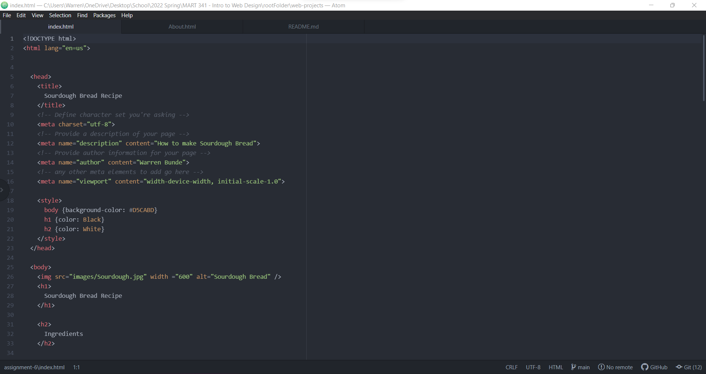

Embed your screenshot here with a relative URL

Describe the difference between structural and semantic markup?

A structural markup is embedded information about the structural elements of a
document.  Structural elements include headings, paragraphs, breaks, and lists.  
Semantic markups are used to reinforce the semantics or meaning of the
information in a document such bold, italics, or underlines.     
