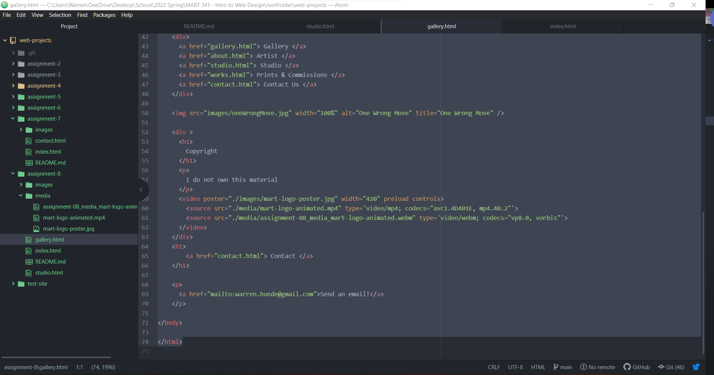

Embed your screenshot here with a relative URL

What is an affordance?

Affordance is the set of possible actions a website designer and developer
provides for user input.

What are the advantages and disadvantages of using a third-party service
like YouTube or Vimeo to host your videos?

There are many advantages and disadvantages of using a third-party service so
to highlight a few: 1. One important advantage is availability of media and frees
storage data space.  2. One important disadvantage is the impermanence of data if
the third party removes data from the server.      
