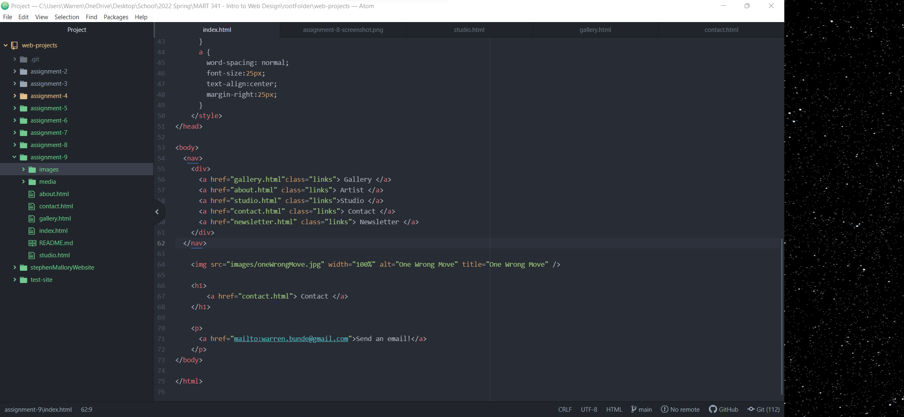

Embed your screenshot here with a relative URL

Learning HTML has been quite a challenge but I feel like I am slowly
getting the hang of it.  I would like to know more about placement and
location of features I am adding to my website which is probably more
involved with CSS. 
