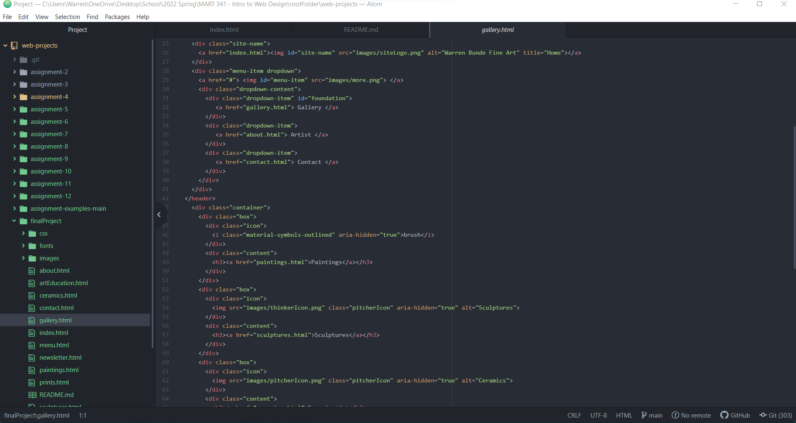

Embed your screenshot here with a relative URL

How did your user testing sessions go?

Testing sessions went will.  I asked two classmates to find the page still under
construction, input a price inquiry, and locate the piece, "Ducky" and find out
what medium was used.  I was able to get some useful information about what to
improve for the future in developing the site.  

What changes (if any) did you make to your website based on the user feedback
you received?

Based on my test feedback, there were a few issues that were overlooked in
addition to picture structuring in the gallery.  I was able to make changes to
both and have some future additions that are planned for the future.  

Optional: What challenges did you face this week, and how did you overcome them?  
