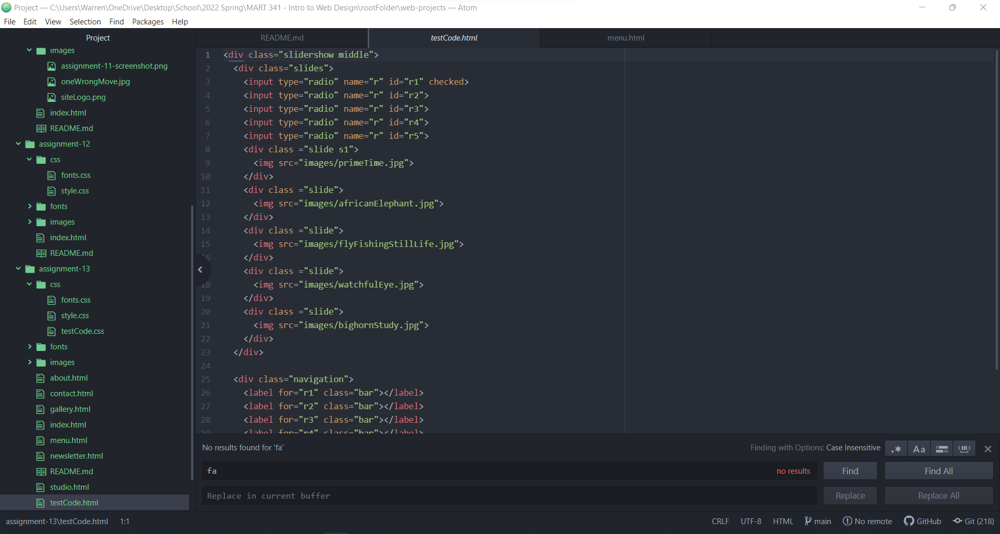

Embed your screenshot here with a relative URL

What is the goal of your website?

The goal of your website is to showcase my artwork and link people into other
crafts and service I have to provide my local community.  

Why is responsive web design important?

Responsive web design is the solution to all the different mobile devices
and size of browser window and to be on a cutting edge website.  The user
interface needs to work on multiple device options.  
